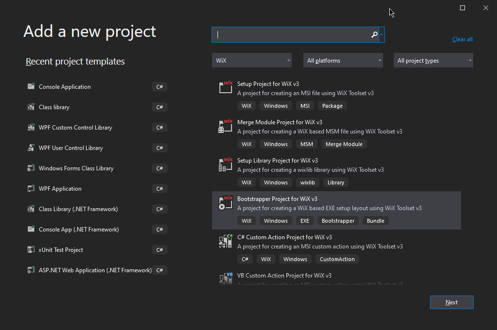
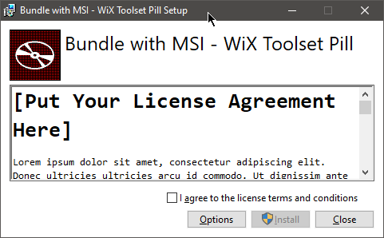
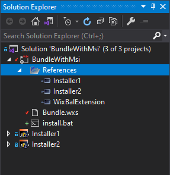
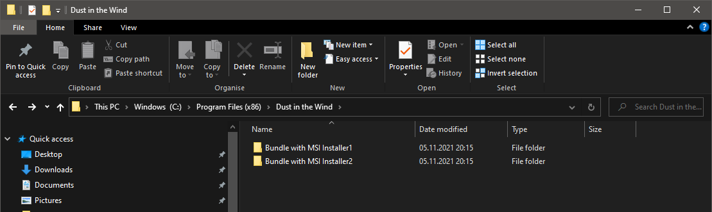
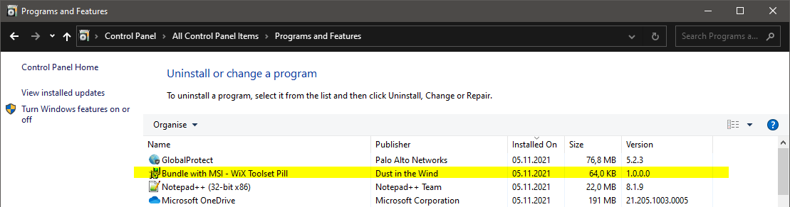
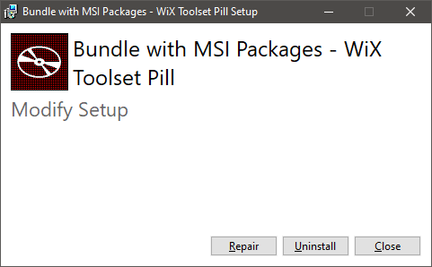

# Bundle with MSI

**Note**: A full example can be found in the `sources` directory from the current repo.

## Prerequisites

Before anything, WiX Toolset must be installed and integrated with Visual Studio.

Install **WiX Toolset build tools** and the **Visual Studio extension** from `https://wixtoolset.org/releases/`.

**Note**: WiX Toolset can be used also independently of Visual Studio, from command line.

## Two MSI Projects

As a first step, let's create two dummy MSI projects that will be, later, included in the bundle:

- `Installer1.msi`
- `Installer2.msi`

 Each installer will deploy a single text dummy file.

The focus of the current tutorial is the bundle itself. Therefore, for more details about creating the dummy installers:

-  check out the example in the `sources` directory or, for even more details,
- check out the "My First Installer" tutorial here: https://github.com/WiX-Toolset-Pills-15mg/My-First-Installer

**Note**: The two MSI files created by these projects are two normal installers that can also be installed independently.

Further, we will see how they can be integrated in a bundle.

## The Bundle

A bundle, unlike the MSI is a WiX concept and it is an executable file that contains and installs a number of packages (MSI or EXE). In this tutorial we will see how to include MSI packages into the bundle.

### Step 1 - The bundle project

Add a new "Bootstrapper Project for WiX v3" project:



### Step 2 - Choose the bootstrapper application

The bootstrapper application is the one that coordinates the whole bundle execution. It may or may not provide a GUI.

WiX Toolset provides a few bootstrapper applications that can be used out of the box. For this tutorial, we will use the `WixStandardBootstrapperApplication.RtfLicense` that displays a default GUI with a single page containing a dummy license agreement.

```xml
<Wix xmlns="http://schemas.microsoft.com/wix/2006/wi">
    <Bundle ...>
        
        <BootstrapperApplicationRef Id="WixStandardBootstrapperApplication.RtfLicense" />
        
        ...
        
    </Bundle>
</Wix>
```

This is how the bundle's GUI looks like:



### Step 3 - Reference the MSI projects

In this tutorial, we have two WiX projects `Installer1` and `Installer2` that builds the two MSI files.

Right-click on the bundle project -> Add -> Reference to reference them from the bundle.



**Note**: If the MSI files are created by a third party or by a project from another solution, there is no need to do anything here. Just make sure you know the path to the MSI files. Usually we copy all the external MSI files in a directory inside the solution directory and use them from there, to always use paths relative to the solution's root directory.

**Note**: If referenced installer projects are renamed, the reference must be manually deleted and recreated.

### Step 4 - Add the MSIs to the Chain

If the two MSI files are generated by projects from the current solution and are referenced by the bundle, as it is the situation in our tutorial, we can use the variables `TargetDir` and `TargetName` to obtain the actual path to the generated MSI files.

```xml
<Wix xmlns="http://schemas.microsoft.com/wix/2006/wi">
    <Bundle ...>
        
        ...
        
        <Chain>
            <MsiPackage SourceFile="$(var.Installer1.TargetDir)$(var.Installer1.TargetName).msi" />
            <MsiPackage SourceFile="$(var.Installer2.TargetDir)$(var.Installer2.TargetName).msi" />
        </Chain>

    </Bundle>
```

When the two installer projects (`Installer1` and `Installer2`) are referenced by the bundle, a number of variables are generated. Two of them can help us here to avoid hard-coding the paths:

- `var.{installer-project-name}.TargetDir` is the `...\bin\Debug` directory of the referenced installer project.
- `var.{installer-project-name}.TargetName` is the actual name of the installer file (e.g. `Installer1.msi`)

**Note**: If referenced installer projects are renamed, the variables used here must be replaced with the new names, too.

**Note**: If external MSIs need to be included in the bundle, the full or relative path must be specified instead.

**Important**: The bundle will install the MSI packages in the order in which they are added to the `Chain` element.

### Step 5 - Build and run the bundle

Build the entire solution.

#### Install

Find the generated exe file in ` ...bin\Debug` and execute it. The bundle will display the following GUI:


Each MSI installer is installed in its own directory just as it would be installed if executed manually.



In "Programs and Features" only the bundle is displayed. No record for the individual MSI installers is added.



#### Logs

The logs are automatically generated in the user's `%TEMP%` directory with the name:

- `BundleName_yyyyMMddHHmmss.log`

The log files for each package (MSI) is generated in the same location with the name

- `BundleName_yyyyMMddHHmmss_#_PackageId.log`

A custom location for the log file can be specified at run time using the `/l` parameter. For example:

```
MyBundle.exe /l "log.txt"
```

More details can be found at FireGiant:

- https://support.firegiant.com/hc/en-us/articles/230912407

#### Uninstall

If the installer is executed again, the bundle automatically detects that it is already installed and offers the repair and uninstall options:

