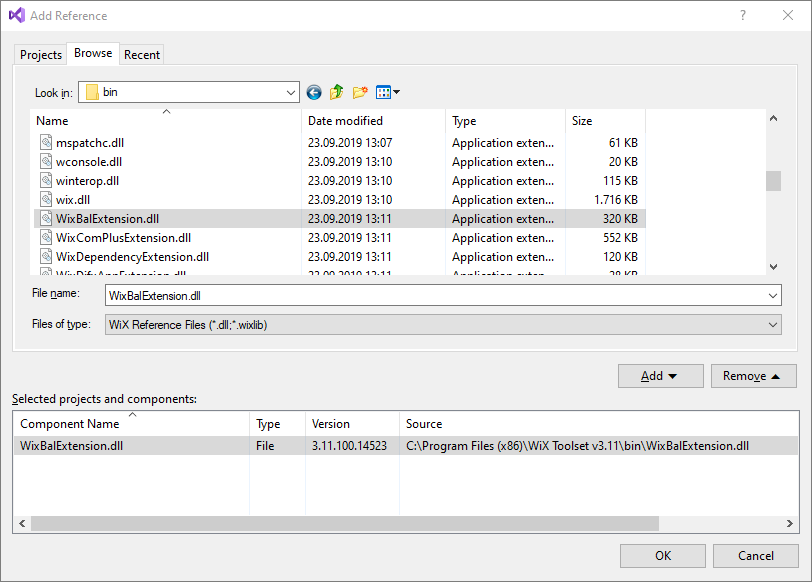

# Bundle with MSI

**Note**: A full example can be found in the `sources` directory from the current repo.

## Prerequisites

Before anything, WiX Toolset must be installed and integrated with Visual Studio.

Install **WiX Toolset build tools** and the **Visual Studio extension** from `https://wixtoolset.org/releases/`.

**Note**: WiX Toolset can be used also independently of Visual Studio, from command line.

## Implementation

### Step 1 - Create Two Dummy MSI Projects

Before starting to create our bundle, let's create two dummy MSI projects that will be, later, included in the bundle:

- `Installer1.msi`
- `Installer2.msi`

 Each installer will deploy a single text dummy file.

The focus of the current tutorial is the bundle itself. Therefore, for more details about creating the dummy installers see the sources and the [My First Installer](https://github.com/WiX-Toolset-Pills-15mg/My-First-Installer) pill.

**Note**: The two MSI files created by these projects are two normal installers that can also be installed independently.

Further, we will see how they can be integrated in a bundle.

### Step 2 - Add a new bundle project

A bundle, unlike the MSI is a WiX concept and it is an executable file that contains and installs a number of packages (MSI or EXE). In this tutorial we will see how to include MSI packages into the bundle.

Add a new "Bootstrapper Project for WiX v3" project in the solution:


### Step 3 - Configure the Bootstrapper Application (and GUI)

The bootstrapper application is the one that coordinates the whole bundle execution. It may or may not provide a GUI.

WiX Toolset provides a few bootstrapper applications that can be used out of the box. For this tutorial, we will use the `WixStandardBootstrapperApplication.RtfLicense` that displays a default GUI with a single page containing a dummy license agreement.

```xml
<Wix xmlns="http://schemas.microsoft.com/wix/2006/wi">
    <Bundle ...>
        
        <BootstrapperApplicationRef Id="WixStandardBootstrapperApplication.RtfLicense" />
        
        ...
        
    </Bundle>
</Wix>
```

This is how the bundle's GUI looks like:


### Step 4 - Create Public Variables

Create two variables for the messages that will be used as arguments for the MSI packages:

```xml
<Variable
    Name="Message1"
    Type="string"
    Value="This is the default message from bundle prepared for Installer 1." />

<Variable
    Name="Message2"
    Type="string"
    Value="This is the default message from bundle prepared for Installer 2." />
```

By default, the variables are private. Unlike the MSI, where the properties are made public by writing their names in all uppercase, in a bundle making the variables public is done explicitly, using the `Overridable` attribute. This attribute is defined in an extension library that must be manually referenced.

#### a) Reference the `WixBalExtension` library

Right click the project -> Add Reference -> Browse -> select the file "c:\Program Files (x86)\WiX Toolset v3.11\bin\WixBalExtension.dll" -> Add -> OK



#### b) Add `bal` namespace

```xml
<Wix
    xmlns="http://schemas.microsoft.com/wix/2006/wi"
    xmlns:bal="http://schemas.microsoft.com/wix/BalExtension">
    
    ...
</Wix>
```

This is needed in order to use, later, the `Overridable` attribute.

#### c) Add the `Overridable` attribute to the variables

```xml
<Variable
    Name="Message1"
    Type="string"
    Value="This is the default message from bundle prepared for Installer 1."
    bal:Overridable="yes" />

<Variable
    Name="Message2"
    Type="string"
    Value="This is the default message from bundle prepared for Installer 2."
    bal:Overridable="yes" />
```

This attribute is allowing the variable to be provided from command line.

### Step 5 - Create Installer 1 Package

#### a) Reference the MSI project

In this tutorial, we have two WiX projects `Installer1` and `Installer2` that builds the two MSI files.

Right-click on the bundle project -> Add -> Reference to reference them from the bundle.


**Note**: If the MSI files are created by a third party or by a project from another solution, there is no need to do anything here. Just make sure you know the path to the MSI files. Usually we copy all the external MSI files in a directory inside the solution directory and use them from there, to always use paths relative to the solution's root directory.

**Note**: If referenced installer projects are renamed, the reference must be manually deleted and recreated.

#### b) Create the MSI package

If the MSI files is generated by projects from the current solution and it is referenced by the bundle, as it is the situation in our tutorial, we can use the variables `TargetDir` and `TargetName` to obtain the actual path to the generated MSI files.

```xml
<PackageGroup Id="Installer1PackageGroup">
    <MsiPackage
        SourceFile="$(var.Installer1.TargetDir)$(var.Installer1.TargetName).msi"
        DisplayName="Installer 1">

        <MsiProperty Name="MESSAGE" Value="[Message1]" />

    </MsiPackage>
</PackageGroup>
```

**Note**: If referenced installer projects are renamed, the variables used here must be replaced with the new names, too.

**Note**: If external MSIs need to be included in the bundle, the full or relative path must be specified instead.

The `<MsiProperty>` tag is used to set a property for the MSI. Add as many as needed.

### Step 6 - Create Installer 2 Package

In a similar way, create the second package:

```xml
<PackageGroup Id="Installer2PackageGroup">
    <MsiPackage
        SourceFile="$(var.Installer2.TargetDir)$(var.Installer2.TargetName).msi"
        DisplayName="Installer 2">

        <MsiProperty Name="MESSAGE" Value="[Message2]" />

    </MsiPackage>
</PackageGroup>
```

### Step 7 - Add packages to the chain

```xml
<Wix
    xmlns="http://schemas.microsoft.com/wix/2006/wi"
    xmlns:bal="http://schemas.microsoft.com/wix/BalExtension">

    <Bundle ...>

        <Chain>
			<PackageGroupRef Id="Installer1PackageGroup" />
			<PackageGroupRef Id="Installer2PackageGroup" />
		</Chain>

    </Bundle>
</Wix>
```

**Important**: The bundle will install the MSI packages in the order in which they are added to the `Chain` element.

### Step 8 - Build and run the bundle

Build the entire solution.

#### Install

Run the bundle with the command:

```
BundleWithMsiPackages.exe /l install.log Message1="Custom message for the Installer 1" Message2="Custom message for the Installer 2"
```

The bundle will display the following GUI:


Each MSI installer is installed in its own directory just as it would be installed if executed independently.


In "Programs and Features" only the bundle is displayed. No record for the individual MSI installers is added.


#### Logs

The logs are automatically generated in the user's `%TEMP%` directory with the name:

- `BundleName_yyyyMMddHHmmss.log`

The log files for each package (MSI) is generated in the same location with the name

- `BundleName_yyyyMMddHHmmss_#_PackageId.log`

A custom location for the log file can be specified at run time using the `/l` parameter. For example:

```
MyBundle.exe /l "log.txt"
```

More details can be found at FireGiant:

- https://support.firegiant.com/hc/en-us/articles/230912407

#### Uninstall

If the installer is executed again, the bundle automatically detects that it is already installed and offers the repair and uninstall options:

